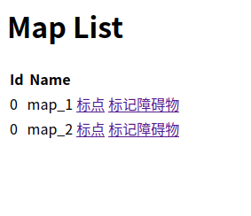

# 坐标点及虚拟墙显示和标注工具

## 运行环境/需求

- JDK 11
- Tomcat 9.0.58

项目运行需要配合 [ros_nodejs_backend](https://github.com/Steve-Mr/ros_nodejs_backend) 使用。
⚠️**注意**⚠️：与ros_nodejs_backend 配合运行需要根据实际情况修改地址，修改位置在 src/main/java/Util/Util 中 SERVER_ADDRESS

## 运行

地图列表地址：```http://localhost:8080/PointMarker_war_exploded/maplist```


